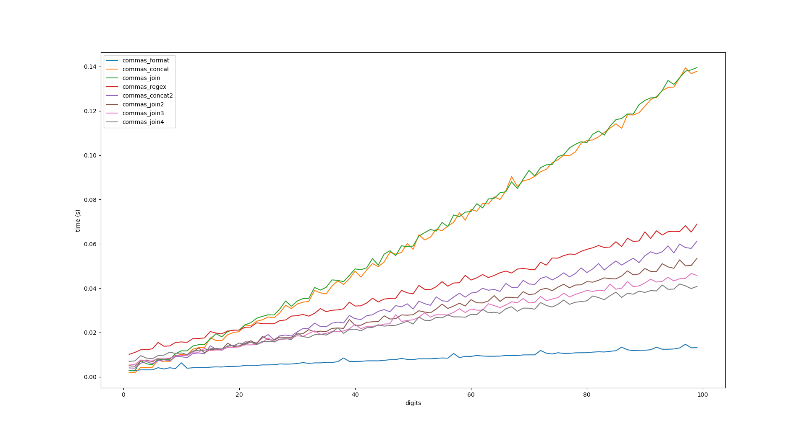
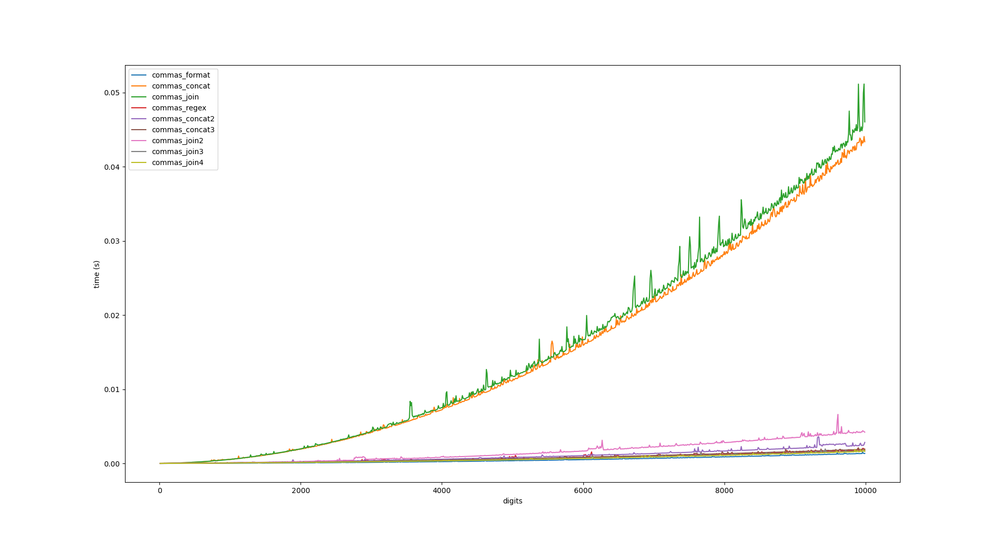
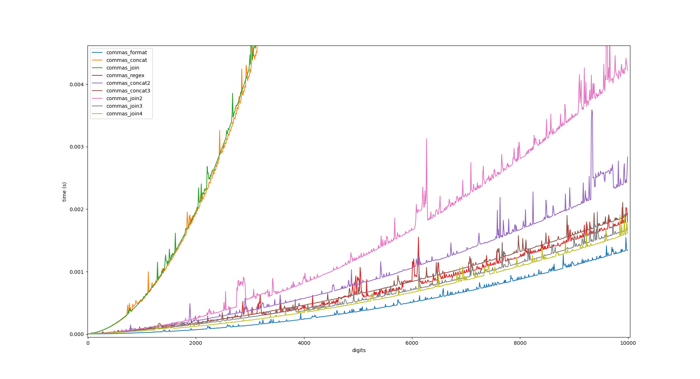
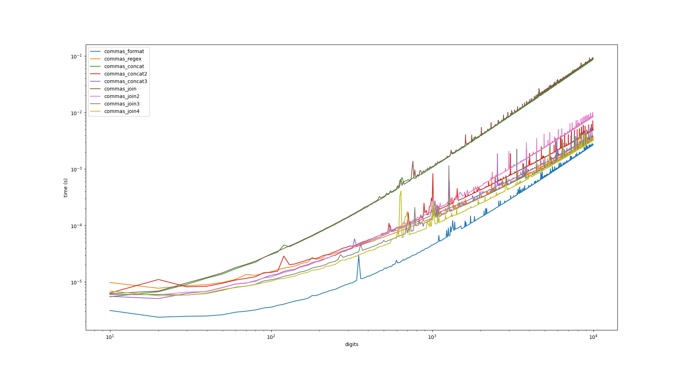

Commas
===

Quick and dirty benchmarks of several comma-insertion implementations. Note that
these implementations are intended to be simple, and therefore most do not
handle edge cases, such as negative values, decimals, etc.

We have ~four~ nine different implementations:

* commas_format: Uses the builtin str.format() to cheat our way to victory.

* commas_concat: Builds the resulting string as we go, via % and // to segment
  the integer. This is supposed to be slow, right?

* commas_join: Builds a list of the segments as in commas_concat, then uses
  str.join() to "guarantee" an O(N) solution.

* commas_regex: Uses a regex for segmentation, then uses str.join(). This can't
  possibly be fast, right?

Some coworkers pondered the performance gap between commas_regex and
commas_{concat, join}, and they suggested that the gap might be from parsing
into a string once, and performance of string manipulation vs math. So, I have
~three~ five more implementations:

* commas_concat2: Similar to commas_concat: we convert the input to a string
  first, then do string concatenation on slices in a loop.

* commas_join2: Similar to commas_join: we convert the input to a string first,
  then append slices to a list a loop, then join at the end.

But then, I noticed a performance gap in these implementation, which I suspected
to be due to prepending to the list / string (versus appending, which should be cheaper):

* commas_concat3: commas_join3, with the loop reversed so we build it up forwards
  as opposed to backwards.

* commas_join3: commas_join2, with the loop reversed so we build it up forwards
  as opposed to backwards.

And, because why not,

* commas_join4: Same as commas_join3, except we use a list comprehension to
  build the list up, then join at the end.

(Lower numbers are better, as this is size of input vs runtime)

Benchmark run via Python 3.8.5 on an i7-7500U. YMMV.

...

Well, it looks like all of these are O(N) solutions, with commas_format
(unsurprisingly) as the clear winner. commas_join and commas_concat behave
roughly equal (I'll refer to these as the "slow" implementations, since bignum
math is slow).

It's interesting to see a spread develop between the various "fast"
implemntations; let's see how they behave with larger inputs.

Notes:

* Rough ordering of solutions: join < concat < join2 < concat2 < concat3 < regex
  < join3 < join4 < format.

* commas_concat, commas_join are still bad.

* commas_join2 is relatively bad compared to the other fast solutions; I
  suspected this was due to list append vs prepend; this hypothesis bore out
  through commas_join3.

* There is a performance gap for commas_concat2, but not as big as that for
  commas_join2.

* I'm not surprised that commas_join4 does the best of non-cheater approaches. I
  am surprised by the effectiveness of commas_regex, which was intended as a
  joke, and how it is in the middle of the pack for fast approaches.

Since it's hard to gauge scaling when the numbers are this big, I've chosen to
use a log-log graph -- polynomials in this view are straight lines, with slopes
corresponding to their degrees.

I suspect the math-based implementations (commas_concat, commas_join) are
actually O(N^2) solutions because I'm doing bignum integer division (with fixed
divisor) in a loop.

I don't know why commas_format seems to scale poorly (per the slope on the
log-log graph), but it's still fast (presumably because it's written in C).

(I made this after seeing [this
gist](https://gist.github.com/llllllllll/7ad5905275233f1fb3868f4a67793616)
posted on HN, which reminded me of a fizzbuzz-style question a colleague asks in
interviews.)
