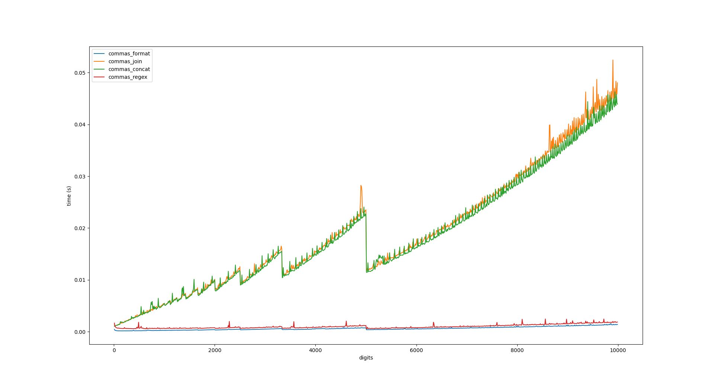
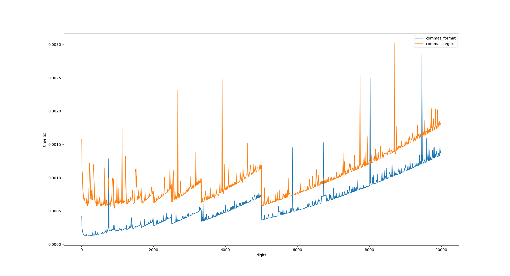

Commas
===

Quick and dirty benchmarks of several comma-insertion implementations. Note that
these implementations are intended to be simple, and therefore most do not
handle edge cases, such as negative values, decimals, etc.

We have four different implementations:

* commas_format: Uses the builtin str.format() to cheat our way to victory.

* commas_concat: Builds the resulting string as we go, via % and // to segment
  the integer. This is supposed to be slow, right?

* commas_join: Builds a list of the segments as in commas_concat, then uses
  str.join() to "guarantee" an O(N) solution.

* commas_regex: Uses a regex for segmentation, then uses str.join(). This can't
  possibly be fast, right?

...

Benchmark run via Python 3.8.5 on an i7-7500U. YMMV.

...

Well, it looks like all of these are O(N) solutions, with commas_format
(unsurprisingly) as the clear winner. commas_join and commas_concat behave
roughly equal, and commas_regex has higher upfront costs (pattern compilation?)
but handles larger inputs better than either join/concat, presumably because
math is expensive.

(I made this after seeing [this
gist](https://gist.github.com/llllllllll/7ad5905275233f1fb3868f4a67793616)
posted on HN, which reminded me of a fizzbuzz-style question a colleague asks in
interviews.)

Benchmarks rerun with larger scales yield... interesting results:

I don't know why there are downward spikes at certain points. JIT optimizations kicking
in after a certain number of executions? These benchmarks are also not at all
scientific.
